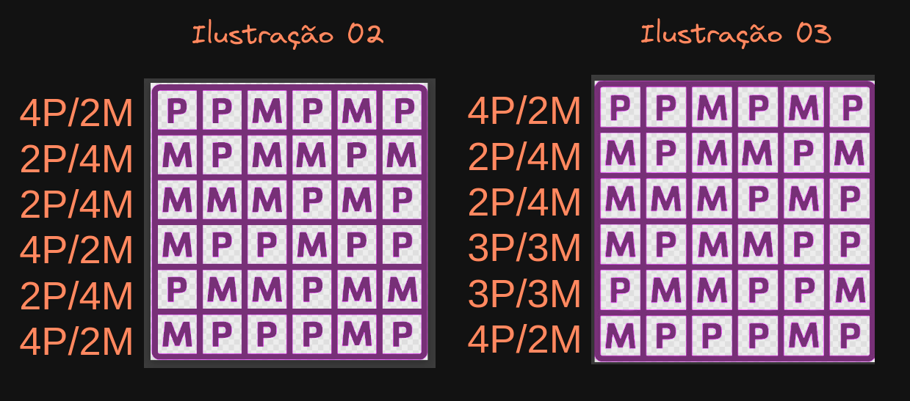

# Instruçoes

## Desafio

Em uma sala de aula, há vinte e cinco alunos.
Entre eles, existem os grupos dos que gostam de Português (P) e os que gostam de Matemática (M).
Eles são divididos conforme a ilustração 1 em anexo.

Depois de um tempo, chegaram mais onze alunos nessa turma e o professor organizou-a conforme a ilustração 2 em anexo.

No entanto, o professor se ausentou da sala por cinco minutos e, ao voltar, percebeu que um aluno que gosta de uma das disciplinas havia trocado de lugar com alguém que prefere a outra, e a turma ficou organizada conforme a ilustração 3 em anexo.

Sabendo que o professor tem dificuldade de memorizar, informe como ele descobriu a cadeira em que houve a troca de alunos e qual a disciplina de cada um.

## Resolução

Após a chegada de mais 11 alunos na sala de aula o professor organizou a sala de maneira que as filas (linhas) ficassem com alunos na proporção de 2:4.

Ele percebeu que um aluno havia trocado de lugar com outro por conta da proporção, que em duas linhas passou a ser 3:3, evidenciando a troca de um aluno que estuda português que outro que estuda matemática.

Assim, apesar da dificuldade de memorização, o professor conseguiu concluir a troca pela proporção.

