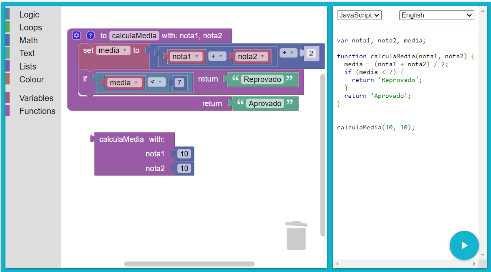

# Instruções

## Desafio

No hipertexto anterior, temos um exemplo de um fluxograma que realiza o cálculo da média de duas notas de um aluno. O fluxograma solicita duas notas que serão somadas, e logo em seguida a média dessas notas é calculada. Dessa forma o resultado da média quando é maior ou igual a 7 o aluno está APROVADO, quando menor que 7 o aluno está REPROVADO.

Utilizando o Google Blockly construa o algoritmos que realiza esse processamento.

## Resolução

A resolução feita no blockly, nesse caso criei uma função que recebe dois parâmetros (duas notas) e faz o cálculo da média.

A função utiliza conceitos de *early return*, no caso em que a nota for menor que 7, irá retornar a string __Reprovado__, nos outros caso (nota maior ou igual a 7), ele retorna __Aprovado__



Solução em Javascript:

```js
function calculaMedia(nota1, nota2) {
  const media = (nota1 + nota2) / 2;
  if (media < 7) {
    return 'Reprovado';
  }
  return 'Aprovado';
}
```
