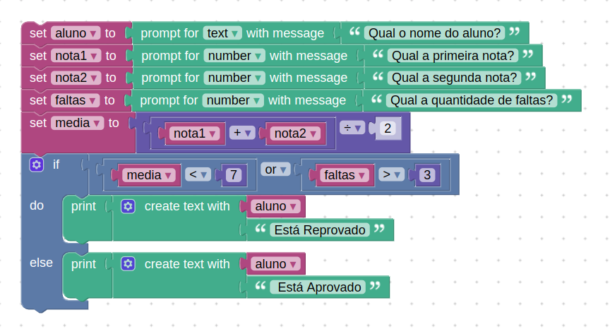

# Instruções

## Desafio

Desenvolva, utilizando o Google Blockly, um programa que utiliza o nome de um aluno, duas notas e a quantidade de faltas que ele teve. Conclua se o aluno está aprovado ou reprovado de acordo com as especificações:

- Se a média do aluno for menor que sete, o sistema deve informar o nome do aluno e que ele está reprovado;
- Se o aluno possuir mais de três faltas, o sistema deve informar o nome do aluno e que ele está reprovado;
Se a média do aluno for maior ou igual a sete, o sistema deve informar o nome do aluno e que ele está aprovado.

No sistema, todos os valores devem estar armazenados em variáveis.

## Resolução

A resolução feita no blockly, nela o usuário, por meio de input, digita o nome do aluno, primeira nota, segunda nota e quantidade de faltas. Após a inserção dos dados o programa calcula a média, verifica a quantidade de faltas e diz se o aluno foi aprovado ou reprovado.



Solução em Javascript:

```js
let nome = prompt("Digite o nome do aluno:");
let nota1 = parseFloat(prompt("Digite a primeira nota do aluno:"));
let nota2 = parseFloat(prompt("Digite a segunda nota do aluno:"));
let faltas = parseInt(prompt("Digite a quantidade de faltas do aluno:"));

// Cálculo da média
var media = (nota1 + nota2) / 2;

// Verificação das condições
if (media < 7 || faltas > 3) {
  alert(nome + " está reprovado.");
} else {
  alert(nome + " está aprovado.");
}
```
