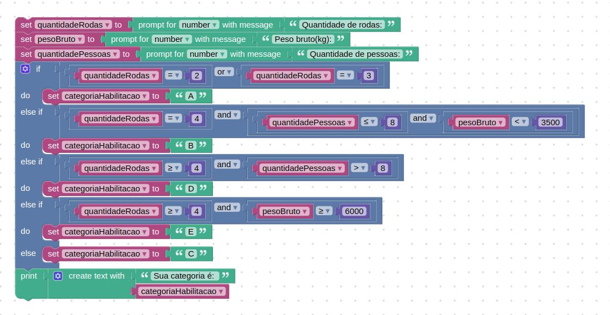

# Instruções

## Desafio

Desenvolva um código, utilizando o Google Blockly, que utilize as seguintes características de um veículo:

- Quantidade de rodas;
- Peso bruto em quilogramas;
- Quantidade de pessoas no veículo.

Com essas informações, o programa mostrará qual é a melhor categoria de habilitação para o veículo informado a partir das condições:
A: Veículos com duas ou três rodas;
B: Veículos com quatro rodas, que acomodam até oito pessoas e seu peso é de até 3500 kg;
C: Veículos com quatro rodas ou mais e com peso entre 3500 e 6000 kg;
D: Veículos com quatro rodas ou mais e que acomodam mais de oito pessoas;
E: Veículos com quatro rodas ou mais e com mais de 6000 kg.

## Resolução

A resolução feita no blockly.



Solução em Javascript:

```js
const quantidadeRodas = prompt("Quantidade de rodas:");
const pesoBruto = prompt("Peso bruto (kg):");
const quantidadePessoas = prompt("Quantidade de pessoas:");

const quantidadeRodasNumber = parseFloat(quantidadeRodas);
const pesoBrutoNumber = parseFloat(pesoBruto);
const quantidadePessoasNumber = parseFloat(quantidadePessoas);

let categoriaHabilitacao = "";

if (quantidadeRodasNumber === 2 || quantidadeRodasNumber === 3) {
  categoriaHabilitacao = "A";
} else if (quantidadeRodasNumber === 4 && quantidadePessoasNumber <= 8 && pesoBrutoNumber <= 3500) {
  categoriaHabilitacao = "B";
} else if (quantidadeRodasNumber >= 4 && quantidadePessoasNumber > 8) {
  categoriaHabilitacao = "D";
} else if (quantidadeRodasNumber >= 4 && pesoBrutoNumber >= 6000) {
  categoriaHabilitacao = "E";
} else {
  categoriaHabilitacao = "C";
}

alert("Categoria de habilitação: " + categoriaHabilitacao);

```
