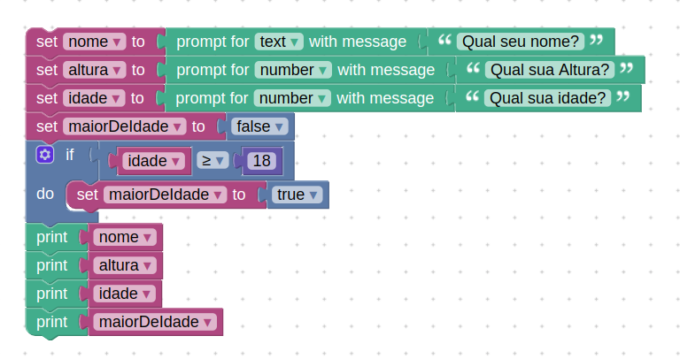

# Instruções

## Desafio

Construa um algoritmo no Blockly que declare as seguintes variáveis: nome, idade, altura e maior_de_idade.

Depois, atribua valores para essas variáveis, sabendo que a variável nome é uma string, a variável idade é um inteiro, a variável altura é um float e a variável maior_de_idade é um booleano.

No final, imprima os valores das variáveis.

## Resolução

A resolução feita no blockly, nela o usuário, por meio de input, digita nome, altura e idade. O próprio código se encarrega de verificar se é maior de idade ou não e retorna um booleano. Após informar todos os dados as informações são apresentadas na tela.



Solução em Javascript:

```js
let nome;
let altura;
let idade;
let maiorDeIdade;

nome = window.prompt('Qual seu nome?');
altura = Number(window.prompt('Qual sua Altura?'));
idade = Number(window.prompt('Qual sua idade?'));
maiorDeIdade = false;
if (idade >= 18) {
  maiorDeIdade = true;
}
window.alert(nome);
window.alert(altura);
window.alert(idade);
window.alert(maiorDeIdade);
```
