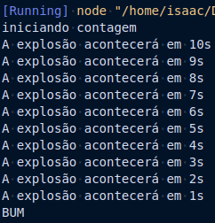

# Desafio 05

## Instruções do projeto

Faça um código, utilizando o Google Blockly, que execute a contagem regressiva de uma bomba, informando o número de segundos para explodir. Ele deverá mostrar a mensagem “iniciando contagem regressiva”, os segundos passados e, no final, a mensagem “BUM!”.

## Resposta

Conforme informado, as respostas não precisam ser necessariamente no bocly, dito isso fiz a resposta em JavaScript com o uso de função e _setTimeout_.

O arquivo [script.js](./script.js) pode ser executado normalmente e o console irá exibir a contagem abaixo:



A solução proposta:

```js
console.log('iniciando contagem');

function iniciaContador(segundos) {
  for (let index = segundos; index >= 0; index -= 1) {
    setTimeout(() => {
      if (index > 0) {
        console.log(`A explosão acontecerá em ${index}s`);
      } else {
        console.log('BUM');
      }
    }, (segundos - index) * 1000);
  }
}
iniciaContador(10);
```
