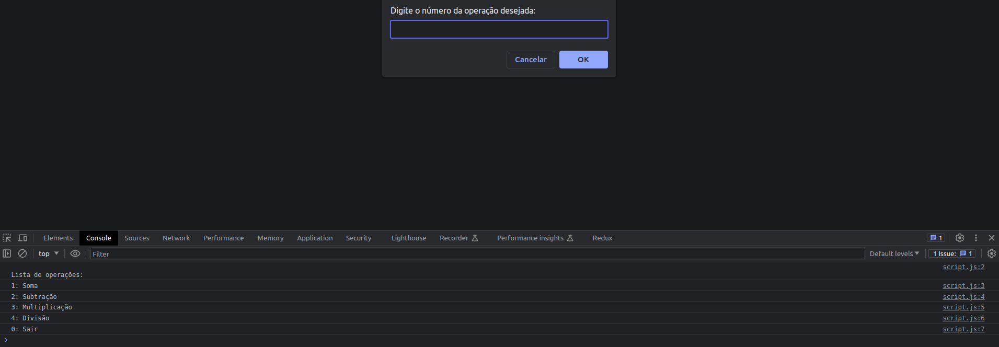
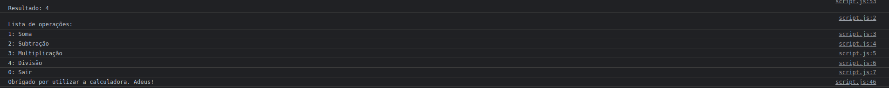

# Desafio 07

## Instruções do projeto

Faça, utilizando o Google Blockly, uma função calculadora que os números e as operações serão feitas pelo usuário. O código deve ficar rodando infinitamente até que o usuário escolha a opção de sair. No início, o programa mostrará a seguinte lista de operações:
1: Soma
2: Subtração
3: Multiplicação
4: Divisão
0: Sair

Digite o número para a operação correspondente e caso o usuário introduza qualquer outro, o sistema deve mostrar a mensagem “Essa opção não existe” e voltar ao menu de opções.

Após a seleção, o sistema deve pedir para o usuário inserir o primeiro e segundo valor, um de cada. Depois precisa executar a operação e mostrar o resultado na tela. Quando o usuário escolher a opção “Sair”, o sistema irá parar. 

É necessário que o sistema mostre as opções sempre que finalizar uma operação e mostrar o resultado.

## Resposta

Conforme informado, as respostas não precisam ser necessariamente no blockly, dito isso fiz a resposta em JavaScript.

O arquivo [script.js](./script.js) pode ser executado normalmente e o console irá exibir o seguinte:



A solução proposta:

```js
function mostrarMenu() {
  console.log("\nLista de operações:");
  console.log("1: Soma");
  console.log("2: Subtração");
  console.log("3: Multiplicação");
  console.log("4: Divisão");
  console.log("0: Sair");
}

function getOperacao() {
  while (true) {
    const operacao = prompt("Digite o número da operação desejada:");
    const parsedOperacao = parseInt(operacao);
    if (!isNaN(parsedOperacao) && parsedOperacao >= 0 && parsedOperacao <= 4) {
      return parsedOperacao;
    } else {
      console.log("Essa opção não existe. Por favor, escolha uma opção válida.");
    }
  }
}

function realizarCalculo(operacao, num1, num2) {
  switch (operacao) {
    case 1:
      return num1 + num2;
    case 2:
      return num1 - num2;
    case 3:
      return num1 * num2;
    case 4:
      return num2 !== 0 ? num1 / num2 : "Divisão por zero não é permitida.";
    default:
      return 0;
  }
}

function runCalculator() {
  let continuar = true;

  while (continuar) {
    mostrarMenu();
    const operacao = getOperacao();

    if (operacao === 0) {
      continuar = false;
      console.log("Obrigado por utilizar a calculadora. Adeus!");
    } else {
      const num1 = parseFloat(prompt("Digite o primeiro número:"));
      const num2 = parseFloat(prompt("Digite o segundo número:"));

      const resultado = realizarCalculo(operacao, num1, num2);

      console.log(`\nResultado: ${resultado}`);
    }
  }
}

runCalculator();
```

