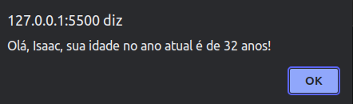

# Desafio 08

## Instruções do projeto

Desenvolva um programa que recebe do usuário nome completo e ano de nascimento que seja entre 1922 e 2021. A partir dessas informações, o sistema mostrará o nome do usuário e a idade que completou, ou completará, no ano atual (2022).

Caso o usuário não digite um número ou apareça um inválido no campo do ano, o sistema informará o erro e continuará perguntando até que um valor correto seja preenchido.

## Resposta

- Primeiro input de nome.


- Segundo input de idade com valor inválido.


- Tela de erro.


- Segundo input de idade com valor válido.


- Tela final.



O arquivo [script.js](./script.js) pode ser executado normalmente junto com o __index.html__.

A solução em JavaScript, fiz uma pequena alteração no código para pegar o ano atual, no lugar de pegar o ano de 2020 para cálculo do ano de nascimento:

```js
function obterAnoNascimento() {
  while (true) {
    const anoInt = parseInt(prompt('Digite o ano em que você nasceu:'));

    if (isNaN(anoInt) || anoInt < 1922 || anoInt > 2021) {
      alert('Ano de Nascimento inválido. Tente novamente.');
    } else {
      return anoInt;
    }
  }
}

function calcularIdade(anoNascimento) {
  const anoAtual = new Date().getFullYear(); //pega o ano atual no lugar de 2022
  return anoAtual - anoNascimento;
}

function exibirIdade() {
  const nome = prompt('Digite seu nome:')
  const anoNascimento = obterAnoNascimento();
  const idade = calcularIdade(anoNascimento);

  alert(`Olá, ${nome}, sua idade no ano atual é de ${idade} anos!`);
}

exibirIdade();
```
